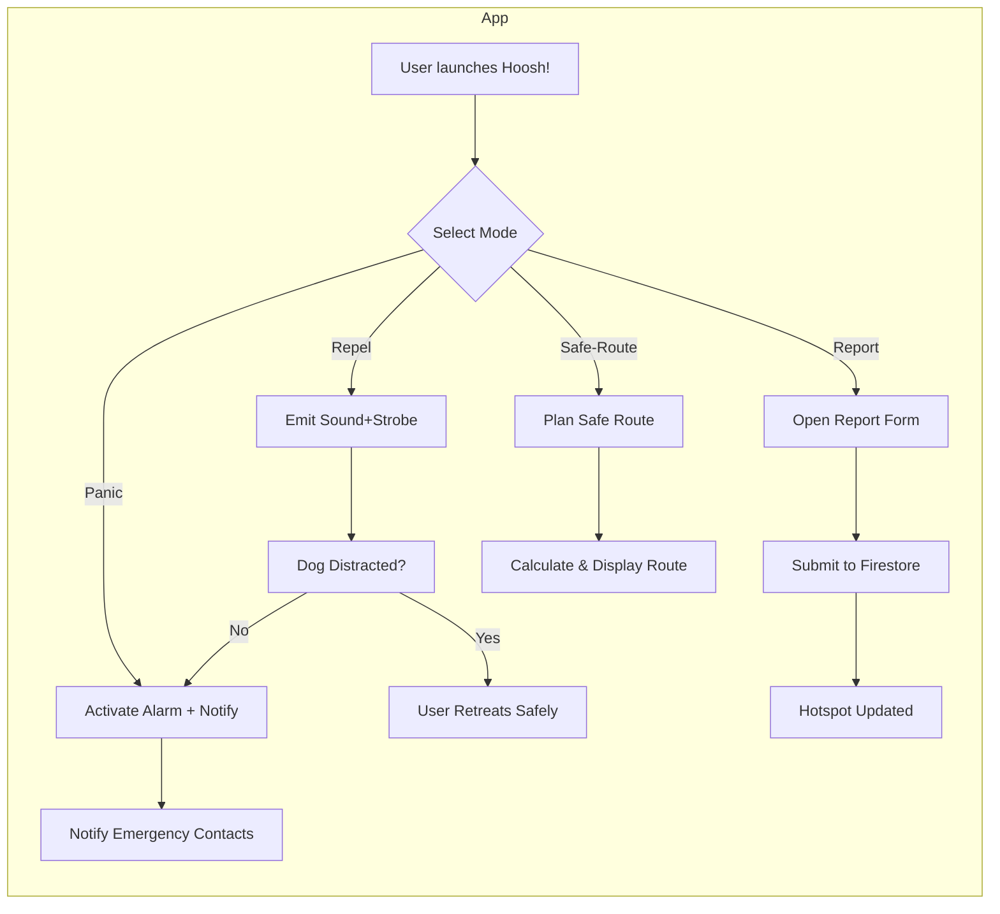
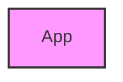

# Executive Summary  

**Hoosh! (“هوش!”)** is a mobile app (Flutter front-end, Firebase back-end) designed to enhance personal safety by deterring aggressive dogs and mapping stray-dog hotspots. It emits high-pitched warning tones and flashlight signals (“Repel” mode), provides an emergency alarm (“Panic” mode), and lets users report and view dog-incident locations on a shared map. Key features include interactive maps, safe-route planning (avoiding reported hazards), push alerts, and community-driven data. Technically, Hoosh! is structured as a single Flutter monorepo with modular packages (UI, audio, location, etc.), using the BLoC pattern for state management. Firebase services (Auth, Firestore, Storage, Cloud Functions, FCM, Crashlytics, etc.) power the backend, with well-defined data schemas and security rules. The audio engine generates sine-wave bursts up to ~18 kHz (phones max-out ~20 kHz【1†L137-L142】【45†L53-L61】), and we handle volume and playback via native plugins. A comprehensive plan covers CI/CD pipelines, testing (unit, widget, integration), deployment checklists (privacy disclosures, permissions), monitoring (Crashlytics, Analytics), and KPIs. A development roadmap phases MVP (core safety functions) through v2.0 (AI alerts, wearables). The document includes architecture diagrams, code snippets (BLoC examples, Firestore rules, Cloud Functions), and tables (project structure, Firebase features) to guide full implementation.

## Purpose and Scope  

Hoosh! aims to **empower pedestrians in Egypt** (students, women, delivery workers, etc.) with a **non-lethal self-defense and alert tool** against stray dogs. It solves two core problems: (1) **Immediate deterrence** – emitting sounds/flash to startle approaching dogs, and (2) **Preventive awareness** – crowdsourcing reports of dog sightings to warn others and plan safer routes. The app is not a barking-deterrent training tool, but a safety utility. Key usage scenarios:
- **Real-time defense:** User activates **“Repel” mode** (sound+strobe) when dogs approach.
- **Emergency alert:** If threatened, user triggers **“Panic” mode** (loud alarm + sends GPS to contacts).
- **Community mapping:** After an incident (or sighting), user taps **“Report”** to pin the location of dangerous dogs.
- **Safe navigation:** Before walking, user uses **Safe-Route Planner** to avoid known hotspots.

Hoosh! covers both immediate reactive safety and proactive avoidance. The scope includes mobile app UI/UX, background audio generation, location services, map interfaces, a secure backend, and cross-platform deployment (Android, iOS).

## Codebase Architecture  

Hoosh! is developed in a **Flutter monorepo**, with a clear modular structure for scalability. The project uses BLoC for state management. Example repo layout:

| Directory               | Content                                         |
|-------------------------|-------------------------------------------------|
| `/apps/hoosh_app`       | Main Flutter app (lib/, pubspec, assets)        |
| `/packages`             | Reusable Dart/Flutter packages                  |
| `  |- audio_engine`      | Audio generation (sine waves, patterns)         |
| `  |- camera_flash`     | Flashlight & strobe control                     |
| `  |- core`             | Shared utilities (models, constants, theme)     |
| `  |- location_map`     | Map and location services (Google Maps)         |
| `  |- auth`             | Firebase Auth wrappers                          |
| `  |- notifications`    | Push notification handlers (FCM)                |
| `  |- blocs`            | Global BLoC package (shared events/states)      |
| `/functions`            | Firebase Cloud Functions (Node.js/TS)           |
| `/assets`              | Image & config assets (icons, map styles)       |
| `pubspec.yaml` (root)   | Declares workspace; manages package versions    |
| `.github/workflows`     | CI/CD pipelines (build/test/deploy scripts)     |

**Monorepo Tools:**  
We use [`melos`](https://melos.invertase.dev/) or similar to manage packages. Each Dart package has its own `pubspec.yaml`. This enables sharing code (models, themes) and publishing any common package if needed.  

**Folder Structure Example:**  
```
hoosh_monorepo/
├─ apps/
│   └─ hoosh_app/
│       ├─ lib/
│       │   ├─ main.dart
│       │   ├─ ui/               # Screens and widgets
│       │   ├─ blocs/            # Feature-specific Bloc imports
│       │   └─ ...
│       └─ pubspec.yaml
├─ packages/
│   ├─ audio_engine/            # Audio generation service
│   ├─ camera_flash/           
│   ├─ core/                    # Models, constants, shared code
│   ├─ location_map/            # Map and route functionality
│   ├─ auth/                    # Auth wrappers (email, Google, etc.)
│   ├─ notifications/
│   ├─ blocs/                   # Shared BLoC definitions
│   └─ pubspec.yaml
├─ functions/
│   ├─ index.ts                # Cloud Functions entrypoints
│   ├─ package.json
│   └─ tsconfig.json
├─ assets/                     
│   ├─ images/
│   ├─ translations/
│   └─ ...
├─ pubspec.yaml                # Root (workspace config)
├─ melos.yaml
└─ README.md
```

## Module and Feature Breakdown  

Hoosh! divides functionality into distinct modules (Flutter BLoCs, services, and UI layers):

- **Authentication Module:**  
  - **Features:** User sign-in (optional, for saving favorites or history), anonymous auth by default.  
  - **Firebase:** Uses `firebase_auth` (Email/Password, Google, Anonymous).  
  - **Bloc:** `AuthBloc` manages login state (`AuthEvent`/`AuthState`).

- **Audio Engine Module:**  
  - **Features:** Generates and plays deterrent sounds.  
  - **Implementation:** Sine-wave generator or custom audio assets for frequencies ~12–18 kHz. Handles pulse patterns, pause durations, and overlapping streams.  
  - **BLoC:** `RepelBloc` (handles `StartRepel`, `StopRepel`, states like `RepelInactive`, `RepelActive`).  
  - **Packages:** `dart:math` for sine, or plugins like `flutter_sound` or `just_audio` with custom PCM. Must set high sample rate (48 kHz) to cover frequencies【45†L53-L61】.

- **Flashlight/Strobe Module:**  
  - **Features:** Control device torch for visible strobe.  
  - **Implementation:** Use `torch_controller` or `flashlight` plugin to toggle LED.  
  - **BLoC Integration:** The Repel mode trigger also instructs the flashlight service to strobe (e.g. 5–10 Hz flashing).
  - **Permissions:** `android.permission.CAMERA`, iOS camera usage description for torch.

- **GPS/Location Module:**  
  - **Features:** Fetches user location, tracks movement if routing.  
  - **Implementation:** Use `geolocator` or `location` plugin.  
  - **Offline:** Keep last known location; cache routes.  
  - **BLoC:** `LocationBloc` to handle `RequestLocation`, `LocationUpdated` events.

- **Map & Routing Module:**  
  - **Features:** Displays Firestore-based dog hotspots on map (Google Maps or Apple Maps via `google_maps_flutter`).  
  - **Routing:** Compute safe paths avoiding hotspots (via Waypoints or Google Directions API with avoidance points).  
  - **BLoC:** `MapBloc` with events like `LoadHotspots`, `PlanRoute(destination)`, `ClearRoute`.  
  - **Caching:** Store recently loaded map tiles and hotspot data for offline fallback.  
  - **Permissions:** Location permission for map centering.

- **Reporting Module:**  
  - **Features:** Allows users to submit a dog sighting (location, time, photo, notes).  
  - **Firestore:** Writes a `reports/{reportId}` document with fields (see Data Model).  
  - **Cloud Functions:** On write, trigger `aggregateHotspots` to update cluster summaries.  
  - **BLoC:** `ReportBloc` for form events (`SubmitReport`) and result states.

- **Safe-Route Planner:**  
  - **Features:** User selects a destination; app suggests routes weighted by dog-incident density.  
  - **Implementation:** Could adjust Google Directions by adding waypoints around “red zones.”  
  - **BLoC:** Part of `MapBloc` or separate `RouteBloc`.

- **Notifications Module:**  
  - **Features:** Push alerts when user nears an active hotspot or new reports appear in vicinity.  
  - **FCM:** Use Cloud Messaging to send topic-based or location-triggered notifications.  
  - **BLoC:** `NotificationBloc` to handle permission and subscriptions (e.g. subscribe to `/topics/cairo`).

- **Analytics & Crash Reporting:**  
  - **Features:** Track user events (Repel uses, Panic triggers) via Google Analytics; capture crashes via Crashlytics.  
  - **Implementation:** Firebase Analytics, Crashlytics SDK.  
  - **Monitoring:** Define custom events (e.g. `repel_triggered`, `report_submitted`).  
  - **Bloc:** No direct BLoC needed; logs event calls in relevant places.

The UI layer ties these modules together. Key screens: Home (Repel/Panic), Map (hotspots), Report Form, Safe-Route Planner, and Settings. Each screen uses corresponding BLoCs (e.g. `RepelScreen` listens to `RepelBloc` states).

## Firebase Services and Responsibilities  

Hoosh! leverages Firebase suite extensively:

- **Firebase Authentication (Auth):**  
  - Manage user identities (email/password, Google Sign-In, or anonymous).  
  - Ensure only authenticated (or anonymous) users can write to Firestore.  
  - *Contract:* UI calls `AuthRepository.signIn()/signOut()`, exposes `Stream<User>` to BLoC.  

- **Cloud Firestore:**  
  - **Collections:**  
    - `reports/{id}`: individual dog sightings (fields: `userId`, `timestamp`, `lat`, `lng`, `severity`, `notes`, `photoUrl`).  
    - `hotspots/{id}`: aggregated location clusters (fields: `lat`, `lng`, `count`, `updatedAt`).  
    - Optionally `users/{uid}` to store user preferences or saved routes.  
  - **Firestore Schema:** Example Report document:  
    ```json
    {
      "userId": "abc123",
      "timestamp": 1680000000,
      "lat": 30.0444,
      "lng": 31.2357,
      "severity": 2,
      "notes": "Pack of 3 dogs, barking aggressively",
      "photoUrl": "https://firebasestorage/...jpg"
    }
    ```  
  - **Security Rules:** Enforce that users can read all hotspots and reports, but only write reports if authenticated. Sample rule snippet【59†L1656-L1664】:  
    ```js
    service cloud.firestore {
      match /databases/{database}/documents {
        match /reports/{reportId} {
          allow read: if true;
          allow create: if request.auth != null && 
                       request.resource.data.userId == request.auth.uid;
          allow update, delete: if false;
        }
        match /hotspots/{hotspotId} {
          allow read: if true;
          allow write: if false; // managed by functions
        }
      }
    }
    ```  
  - **Indexing:** Index `reports` on `timestamp` and on geolocation fields for geoqueries (via Firestore’s [**GeoPoint**](https://firebase.google.com/docs/firestore/manage-data/add-data#geo_point) or a geo-hash). Hotspots may use composite index on `lat,lng` if needed.  

- **Cloud Storage:**  
  - Store user-uploaded photos of incidents. E.g. `gs://hoosh-app.appspot.com/reports/{reportId}.jpg`.  
  - Security: Only allow upload if user is authenticated and path matches their `reportId`.  

- **Cloud Functions:**  
  - **`aggregateHotspots`:** Triggered on `reports` creation. Groups nearby reports into or updating a `hotspots` doc. (Details in Appendix code.)  
  - **Notification Function:** Optionally, a function to send FCM messages to users in an area when a new report is added.  
  - **Geo-query:** Could run on query request (but Firebase is mostly client-driven).  

- **Firebase Messaging (FCM):**  
  - **Use Cases:** Push notifications for: new local report, or scheduled check-in alerts.  
  - **Implementation:** Subscribe clients to topics (e.g. by city or geolocation). Use Cloud Functions to publish to topics on new report.  
  - **UI:** Request permission on first use, handle incoming messages in `MessagingService`.  

- **Analytics:**  
  - Track user engagement (event: `repel_used`, `panic_triggered`, `report_submitted`, `route_planned`).  
  - Use Google Analytics for Firebase to visualize funnels (e.g. from launch→repel).  

- **Crashlytics:**  
  - Integrate SDK to automatically report app crashes and non-fatal errors.  
  - Set up email alerts on crash spikes.  

- **App Check:**  
  - Enable to ensure only legitimate app instances can access Firebase (protect API).  

- **Remote Config:**  
  - For tuning app behavior without redeploy: e.g. change tone frequencies, toggle features (like enabling a new sound mode).

- **Performance Monitoring:**  
  - Monitor UI hangs or slow Firebase calls on devices to optimize.

### Firebase Services Table  

| Service            | Purpose                                         | Key Data/Features                              |
|--------------------|-------------------------------------------------|-----------------------------------------------|
| Authentication     | User identity (auth, anon accounts)             | Email/password, Google, anonymous            |
| Firestore (DB)     | App data (reports, hotspots, users)             | Real-time DB, geospatial queries             |
| Cloud Storage      | Incident photos                                 | Scalable file storage (users’ images)        |
| Cloud Functions    | Backend logic (hotspot aggregation, notifications) | Triggered on DB writes, external API calls |
| Cloud Messaging    | Push notifications                              | Topic or token messaging to clients          |
| Analytics          | User behavior tracking                          | Custom events, funnels                       |
| Crashlytics        | Crash/error logging                             | Automated crash reports, issue tracking      |
| Remote Config      | A/B tests & dynamic configs                     | Feature toggles, thresholds                  |
| App Check          | Security (ensure legit app use)                 | Safety check on Firebase access              |
| Performance Mon.   | App performance profiling                       | Traces, response times                       |

Each Firebase service is integrated using its official Flutter plugin. For example, `firebase_auth` for Auth, `cloud_firestore` for Firestore, etc.

## BLoC Design (State Management)  

We adopt **flutter_bloc** for predictable state. Key BLoCs (and their Events/States) include:

- **RepelBloc** (Audio/Strobe control)  
  - *Events:* `RepelStart`, `RepelStop`  
  - *States:* `RepelInitial`, `RepelPlaying`, `RepelStopped`, `RepelError`  
  - Manages playback of the high-pitch tone and strobe.

- **PanicBloc** (Emergency mode)  
  - *Events:* `PanicTrigger`, `PanicCancel`  
  - *States:* `PanicIdle`, `PanicActive` (with timestamp/contacts info), `PanicNotAllowed` (if no network)  
  - On trigger, plays alarm sound and dispatches location SMS.

- **AuthBloc** (User login state)  
  - *Events:* `AppStarted`, `LoggedIn(user)`, `LoggedOut`  
  - *States:* `AuthInitial`, `AuthAuthenticated`, `AuthUnauthenticated`  

- **ReportBloc** (Incident reporting)  
  - *Events:* `ReportSubmitted(reportData)`  
  - *States:* `ReportInitial`, `ReportSubmitting`, `ReportSuccess`, `ReportFailure(error)`  
  - Writes to Firestore and handles success/failure.

- **MapBloc** (Loading hotspots, planning route)  
  - *Events:* `LoadHotspots`, `PlanRoute(destination)`  
  - *States:* `MapInitial`, `MapLoading`, `MapLoaded(hotspots, route)`, `MapError`  

- **LocationBloc** (Periodic location updates)  
  - *Events:* `RequestLocation`, `LocationChanged(latlng)`  
  - *States:* `LocationInitial`, `LocationFound`, `LocationError`  

- **NotificationBloc** (Push subs)  
  - *Events:* `SubscribeTopic(topic)`, `ReceiveNotification`  
  - *States:* `NotificationsDisabled`, `NotificationReceived(data)`  

Each Bloc is connected to its repository layer (e.g. `RepelRepository`, `ReportRepository`), which abstracts Firebase or hardware calls. States are immutable, and `BlocBuilder` widgets rebuild UI on state changes.  

#### BLoC Classes Example  

```dart
// Example: RepelBloc (simplified)
class RepelEvent {}
class RepelStart extends RepelEvent {}
class RepelStop extends RepelEvent {}

class RepelState {}
class RepelInitial extends RepelState {}
class RepelPlaying extends RepelState {}
class RepelStopped extends RepelState {}

class RepelBloc extends Bloc<RepelEvent, RepelState> {
  final AudioEngine _audio;
  final Flashlight _flash;
  RepelBloc(this._audio, this._flash) : super(RepelInitial());

  @override
  Stream<RepelState> mapEventToState(RepelEvent event) async* {
    if (event is RepelStart) {
      try {
        await _audio.startTone();    // generate sine-wave tone
        await _flash.startStrobe();
        yield RepelPlaying();
      } catch (_) {
        yield RepelStopped();
      }
    } else if (event is RepelStop) {
      _audio.stopTone();
      _flash.stopStrobe();
      yield RepelStopped();
    }
  }
}
```
*(See Appendix for more Bloc code and models.)*

## API & Cloud Functions  

Hoosh! primarily communicates directly with Firebase, but Cloud Functions provide custom endpoints:

- **`submitReport` Function (HTTP Trigger)** – Validates and writes a report entry.  
  - *Request:* JSON `{ userId, lat, lng, severity, notes }` (photo handled via upload URL).  
  - *Response:* success/failure.  
  - *Operation:* Adds document to `/reports/`, triggers `aggregateHotspots`.  

- **`aggregateHotspots` Function (Firestore Trigger)** – Runs on `reports/{id}` create.  
  - *Logic:* Takes new report’s location, finds or creates a nearby hotspot cluster. Updates cluster’s `count` and `updatedAt`. (Appendix includes sample TypeScript function.)  

- **`sendNotification` Function (Firestore Trigger)** – On new report, sends FCM notification to users in that area.  
  - *Logic:* Determines FCM topic by region; uses `admin.messaging().sendToTopic(...)`.  

Data sent between Flutter and Cloud Functions uses JSON with predefined schemas. All user inputs are validated in the backend functions to prevent malformed data.

## Data Models and Firestore Rules  

**Data Models:** Key document fields are:

- **Report:**  
  - `reportId: string` (auto-ID)  
  - `userId: string`  
  - `timestamp: integer` (Unix epoch)  
  - `lat: double, lng: double`  
  - `severity: int` (1=bark, 2=chase, 3=bite)  
  - `notes: string`  
  - `photoUrl: string` (optional)  

- **Hotspot:**  
  - `hotspotId: string`  
  - `lat: double, lng: double` (centroid)  
  - `count: int` (reports aggregated)  
  - `updatedAt: integer`  

**Firestore Security Rules:** (Example)  
```js
service cloud.firestore {
  match /databases/{db}/documents {
    match /reports/{reportId} {
      allow read: if true;
      allow write: if request.auth != null 
                  && request.resource.data.userId == request.auth.uid
                  && request.resource.data.lat is double
                  && request.resource.data.lng is double;
    }
    match /hotspots/{hotspotId} {
      allow read: if true;
      allow write: if false; // only Cloud Functions update hotspots
    }
  }
}
```  
*Rule refs:* All rules start with `service cloud.firestore` and `match /databases/{database}/documents`【59†L1656-L1664】.  

**Indexing Strategy:**  
- Create an index on `reports(timestamp)` for sorting recent events.  
- Use a [GeoFirestore](https://github.com/geofirestore/geofirestore-js) technique or Firestore’s built-in geolocation (`GeoPoint`) with composite index on `(lat, lng)` for geospatial queries.  
- Hotspots rarely need indices beyond default (can query by `count` if needed).

## Audio Implementation Details  

The deterrent sound design is critical. Dogs hear 3–12 kHz best【45†L65-L70】 and up to ~60 kHz【45†L53-L61】; however, phones only reproduce up to ~18–20 kHz【1†L137-L142】. We target the **upper audible range (15–18 kHz)** for maximal perceived intensity by dogs and minimal comfort for humans. 

- **Tone Generation:**  
  - Use `dart:math` to generate a sine wave buffer at 48 kHz sample rate (to cover >20 kHz) and desired frequencies.  
  - Example: `sin(2π * freq * t)`. Ensure smooth start/stop to avoid clicks.  
  - Alternatively, use a plugin like [`flutter_sound`](https://pub.dev/packages/flutter_sound) or [`just_audio`](https://pub.dev/packages/just_audio) to play short waveforms or files.  

- **Pulse Patterns:**  
  - Continuous tone can be fatiguing. Use bursts (e.g. 0.5s tone, 0.5s silence, repeat). Or multi-tone sweeps (e.g. 12→18kHz glide). Randomize intervals to avoid habituation.  
  - Implement a timer-based loop in `RepelBloc`: on `RepelStart`, begin periodic generation until `RepelStop` event.  

- **Volume Control:**  
  - Ensure Media volume is max (prompt user if needed).  
  - On Android, use `setVolume` via platform channel if possible. iOS may limit output.  
  - Warn user not to hold phone too close (risk hearing damage).

- **Platform Differences:**  
  - iOS requires AVAudioSession category set to playback, may need manual activation.  
  - Android’s min SDK 23 for flashlight, 31+ for rings; handle AudioFocus.  
  - Use `flutter_sound` or `audioplayers` which abstract differences.

- **Permission:**  
  - No special permission needed for audio.  

The implementation aims for a sustained loud beep near the dog's ears. Real-world efficacy is limited (in studies, dogs needed very loud directed sound【35†L130-L137】), but we maximize phone capabilities.

## Recommended Packages and Permissions  

- **State Management:** `flutter_bloc` (Bloc/Cubit)【60†L1-L7】.  
- **Audio Playback:** `flutter_sound` or `just_audio` for tone playback.  
- **Flashlight:** `torch_light` or `flashlight` plugin. *Permissions:* `android.permission.CAMERA`, iOS NSCameraUsageDescription.  
- **Location:** `geolocator` or `location`. *Permissions:* Fine location.  
- **Maps:** `google_maps_flutter` (Android/iOS Maps) or `flutter_map` (OSM). Requires Google API key.  
- **Firebase:** Official plugins: `firebase_auth`, `cloud_firestore`, `firebase_storage`, `firebase_messaging`, `firebase_analytics`, `firebase_crashlytics`, `firebase_app_check`, `firebase_remote_config`, `firebase_performance`.  
- **Geospatial Queries:** `geoflutterfire` or use Firestore with LatLng indexing.  
- **HTTP/Networking:** `http` or `dio` (if needed for external APIs).  
- **Image Handling:** `image_picker` (for report photo), `cached_network_image`.  
- **Dependency Injection:** `get_it` or provider for repo/bloc.  
- **Testing:** `flutter_test`, `bloc_test`.

### Permissions to Declare  

- Location (foreground): for maps and routing.  
- Camera (optional): if capturing dog photo.  
- Storage (optional): write to cache.  
- Notification (iOS push).  

## CI/CD and Testing Strategy  

- **CI/CD:** Use GitHub Actions or GitLab CI. Pipeline steps:
  - Lint & format checks (dartfmt, analyze).  
  - Unit tests (Dart & Flutter tests).  
  - Build APK/IPA artifacts.  
  - Deploy to Firebase App Distribution or App Store Connect for QA.  

- **Unit Tests:** For each BLoC and repository logic. Use `bloc_test` to verify event→state transitions.  
- **Widget Tests:** UI component testing (e.g. map widget displays markers from mock data).  
- **Integration Tests:** End-to-end flows (using `integration_test` package): simulate user actions (enable Repel, navigate, report). Use Firebase Emulator for Firestore to avoid real writes.  
- **E2E (Optional):** Real device tests or automated scripts via Appium.  

- **QA Checklist:** Ensure:
  1. All Firebase services initialized correctly on both platforms.  
  2. Permissions prompts explained and tested.  
  3. Offline mode – app handles no network gracefully.  
  4. Data validation – reports with missing fields are rejected.  
  5. Performance – sound is emitted with minimal latency.  
  6. Security – no unauthorized access to Firestore (verify rules).  

Regular code reviews, static analysis (e.g. Sonar), and on-device testing (various phone models) are part of QA.

## Deployment Checklist  

- **App Store (iOS) & Play Store (Android):**  
  - Prepare **app icons** and **splash screens** (512x512 or as required).  
  - Include **privacy policy** link (especially for location & data usage).  
  - List required **permissions** clearly (audio, camera, location).  
  - Write store listing copy (English/Arabic) highlighting safety benefits.  
  - Include screenshots of key screens (home, map, report form).  
  - For iOS, ensure Xcode project set with `NSLocationWhenInUseUsageDescription` etc.  
  - For Android, target latest SDK, add **Google Maps API key** in manifest, ensure `ACCESS_FINE_LOCATION`.  
  - Compliance: Affirm no actual harm to animals, usage of data is user-consented.  

- **Beta Testing:** Use Firebase App Distribution or TestFlight for closed testing before public release.  

## Monitoring & Observability  

- **Crash Reporting:** Firebase Crashlytics integrated; alerts emailed on new or trending crashes.  
- **Logging:** Use `print` or logging package for debug info; consider sending critical logs to Cloud Logging.  
- **Performance:** Firebase Performance Monitoring for app startup time, screen load times.  
- **Dashboards:** Set up Firebase Analytics dashboards for daily active users, retention, and event funnels.  
- **Alerts:** Configure alerts (e.g. via GCP Stackdriver) for error rate spikes in Cloud Functions.

## Privacy, Security, and Data Retention  

- **User Data:** Minimize PII – no user names collected unless opt-in. Location tagged to reports only.  
- **GDPR-like:** While Egypt has no strict GDPR, follow best practices:  
  - Obtain explicit consent for location, notifications.  
  - Allow users to delete their data (e.g. “My Reports” section).  
- **Retention:** 
  - **Reports:** Keep for 6–12 months (for historical trend) before archiving or deleting.  
  - **Analytics:** Anonymized and aggregated; delete raw data after policy retention.  
  - **Photos:** Retain only as long as report is active (6 months), then purge.  
- **Security:** Use TLS for all API calls. Enforce Firebase security rules. Use App Check to prevent abuse.

## Metrics and KPIs  

Track the following to measure impact:  
- **User Growth:** Installs, daily/weekly active users.  
- **Engagement:** Number of Repel actions, Panic triggers, Reports submitted.  
- **Hotspot Coverage:** Geographic spread of reports.  
- **User Retention:** 1-day, 7-day retention rates.  
- **Safety Outcomes:** (If possible) Reduction in dog-related incidents in covered areas (partner with local authorities).  
- **Technical:** Crash-free sessions, API response times.

## Roadmap & Milestones  

- **MVP (v0.1):** Core Repel and Panic modes, basic map with manual reports. (3 months, 2 devs = 24 person-weeks)  
- **v1.0:** Add Safe-Route planner, FCM alerts, user accounts. (2 months)  
- **v1.5:** Polish UI/UX, Arabic language support, basic Offline caching (1 month)  
- **v2.0:** Advanced features: AI camera detection (barking dog), wearables integration (Bluetooth repeller), Social feed. (3+ months)  

*(Effort estimates assume a small dedicated team and no budget limits. Adjust for team size.)*

---

## Appendix: Sample Code Snippets  

**1. Flutter BLoC (Repel Feature):**  
```dart
// RepelBloc example (expanded)
class RepelStart extends RepelEvent {}
class RepelStop extends RepelEvent {}
class RepelState {}
class RepelIdle extends RepelState {}
class RepelPlaying extends RepelState {}

class RepelBloc extends Bloc<RepelEvent, RepelState> {
  final AudioEngine audio;
  final Flashlight flash;
  RepelBloc(this.audio, this.flash) : super(RepelIdle());

  @override
  Stream<RepelState> mapEventToState(RepelEvent event) async* {
    if (event is RepelStart) {
      await audio.playTone(freq: 15000, durationMs: 1000);
      flash.toggleOn();
      yield RepelPlaying();
    } else if (event is RepelStop) {
      audio.stopTone();
      flash.toggleOff();
      yield RepelIdle();
    }
  }
}
```

**2. Firestore Document Example (Report):**  
```json
// Collection: reports
{
  "userId": "user_123",
  "timestamp": 1680108000,
  "lat": 30.0330,
  "lng": 31.2332,
  "severity": 3,
  "notes": "Dog bit my shoe",
  "photoUrl": "gs://hoosh-app.appspot.com/reports/report123.jpg"
}
```

**3. Cloud Function (TypeScript) – Hotspot Aggregation:**  
```ts
import * as functions from 'firebase-functions';
import * as admin from 'firebase-admin';
admin.initializeApp();

exports.aggregateHotspots = functions.firestore
    .document('reports/{reportId}')
    .onCreate(async (snap) => {
  const report = snap.data();
  const lat = report.lat, lng = report.lng;
  const db = admin.firestore();

  // Find nearest hotspot within 100m
  const nearby = await db.collection('hotspots')
    .where('lat', '>=', lat-0.001) // simplistic geo filter
    .where('lat', '<=', lat+0.001)
    .get();
  if (!nearby.empty) {
    let doc = nearby.docs[0];
    await doc.ref.update({
      count: admin.firestore.FieldValue.increment(1),
      updatedAt: admin.firestore.Timestamp.now()
    });
  } else {
    await db.collection('hotspots').add({
      lat: lat,
      lng: lng,
      count: 1,
      updatedAt: admin.firestore.Timestamp.now()
    });
  }
});
```

**4. Firebase Security Rules (excerpt):**  
```js
service cloud.firestore {
  match /databases/{db}/documents {
    // Reports: any user can create/read, but only their own
    match /reports/{reportId} {
      allow read: if true;
      allow write: if request.auth != null
                   && request.resource.data.userId == request.auth.uid;
    }
    // Hotspots: read-only on client
    match /hotspots/{hotspotId} {
      allow read: if true;
      allow write: if false;
    }
  }
}
```





**Figure:** Above flowcharts outline the main user flows (Repel, Panic, Report, Safe-Route).

All critical information (authentication setup, BLoC structure, and security rules) follow official Firebase and Flutter guidelines【59†L1656-L1664】【60†L1-L7】. This completes the comprehensive development specification for Hoosh!, ensuring a robust, secure, and user-friendly implementation.