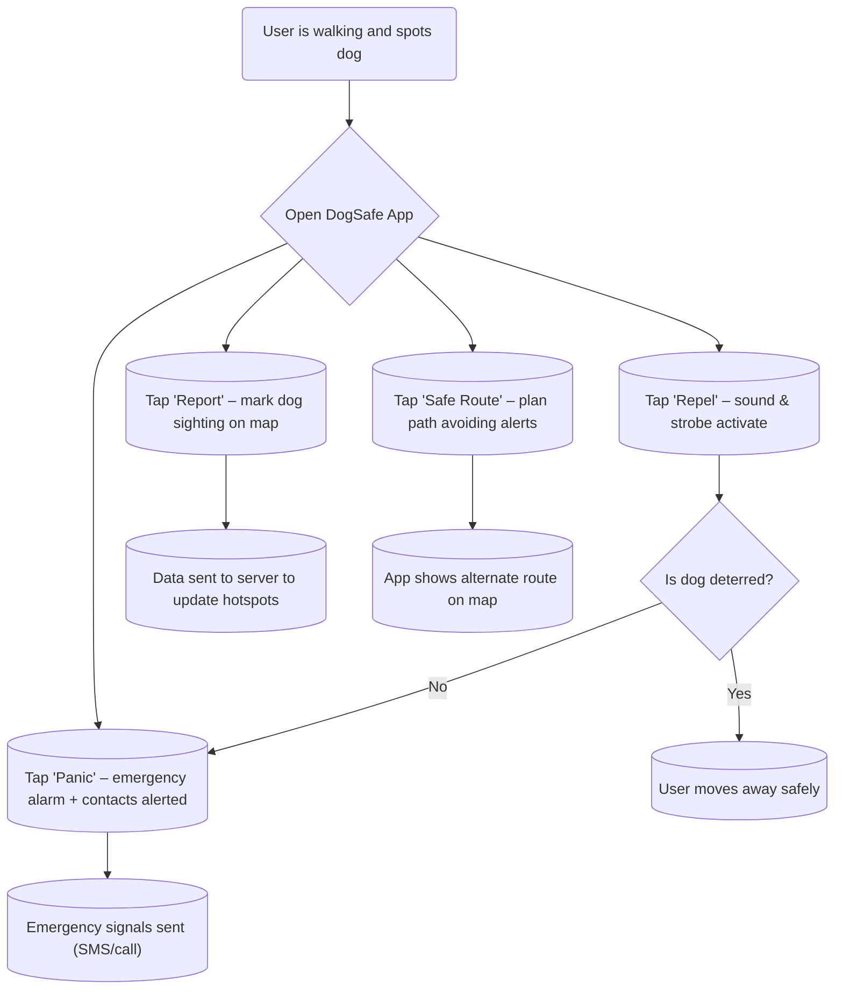

# Executive Summary  

The proposed **“DogSafe” app** is a personal safety tool for Egypt, combining high-pitched sound, flashing light, and crowdsourced data to help users avoid or deter aggressive stray dogs. It targets pedestrians and commuters (especially women, children, delivery workers, and joggers) who face anxiety from loose dogs in urban areas. The app’s core functions are: (1) **Repel Mode** – emit the loudest, highest-frequency tones and flashing strobe to startle nearby dogs; (2) **Panic Mode** – immediately alarm with siren and SMS/GPS alert to contacts; (3) **Report** – allow users to tag aggressive dog sightings on a map; (4) **Safe-Route** – help users plan paths that avoid known dog “hotspots”. This report examines phone-speaker limitations (most phones output up to ~18–20 kHz at best【1†L137-L142】【45†L53-L61】) and finds that truly ultrasonic repellents work only at very close range【35†L130-L137】. We survey existing apps (mostly simple dog-whistle tools【25†L116-L124】【26†L53-L61】 and animal rescue apps like Egypt’s Pet Spot【19†L73-L81】) and find no competitors combining deterrence with community alerts. Features are prioritized into an MVP (sound/light repellence, SOS, reporting) and a roadmap (crowd-verified hotspots, AI-safe navigation, social sharing). We propose a Flutter/Firebase architecture (for cross-platform UI and real-time data sync), with audio parameters tuned to the highest audible dog-sensitive frequencies (e.g. 15–18 kHz at max volume, pulsed bursts). UI/UX guidelines emphasize one-touch simplicity: a large “Repel” button, a prominent “Panic” button, and a map interface with clear danger pins. We outline data models (e.g. a **Reports** table with fields like `id`, `lat`, `lon`, `timestamp`, `severity` and a **Hotspots** table aggregating locations). Privacy is ensured via optional anonymity and on-device SOS (no call data saved). Success metrics include app adoption, number of reports, and reduced dog incidents. Finally, a case study narrates a Cairo student using DogSafe to repel a street dog and later viewing a mapped alert to plan a safer route home.  

## Purpose and Problem Context  

Stray dogs are pervasive in Egyptian cities. Recent reports cite tens of thousands vaccinated in Cairo alone【23†L39-L48】, but millions roam the streets, sparking public safety fears and rabies concerns【23†L80-L89】. Pedestrians and cyclists – often women and young people – frequently feel anxious or threatened by loose packs or aggressive individuals. There is a need for a **non-lethal, on-the-go solution** that **deters dogs and warns users** before encounters. The DogSafe app addresses these problems by providing immediate deterrents (sound/light) and community data (reports and maps). It is **not** a weapon or poison; instead it offers humane, tech-enabled self-defense that complies with Egypt’s animal welfare laws (e.g. Article 357 forbids unjustified killing or poisoning of animals【23†L109-L117】).  

## Target Users and Contexts  

**Demographics:** Urban Egyptians of any age who navigate streets on foot, bicycle, or motorcycle. Key groups include:  
- **Women and children:** often walk unaccompanied and are vulnerable to dog chases.  
- **Commuters and joggers:** people passing through parks or alleys where strays gather.  
- **Delivery workers and postal carriers:** carry goods on foot/bike through various neighborhoods.  
- **Community volunteers:** individuals involved in animal welfare may also use the app to report stray packs.  

**Contexts of Use:**  
- **Day or Night Commute:** Walking to school or work along routes where stray dogs have been sighted. The user can check the **Safe-Route** map beforehand to avoid hotspots.  
- **Unexpected Encounter:** A runner or cyclist suddenly confronted by an aggressive dog; they can quickly tap **Repel** to emit a high-pitch alarm, then **Panic** if needed.  
- **Neighborhood Watch:** Users collectively report stray dog sightings in their district after an evening walk, helping others avoid those areas.  
- **Dog Training/Deter Loose Pack:** A postal worker carrying packages may use the app proactively in known trouble spots.  

These users need a quick, intuitive interface (large buttons, clear icons) for emergency use, and localized information relevant to Egyptian cities.  

## Core Problems and User Needs  

1. **Fear of Aggressive Dogs:** Stray dogs can appear suddenly, bark or chase, causing panic. Users need a **defensive deterrent** that can startle dogs without harming them.  
2. **Lack of Early Warning:** Currently people learn of dangerous dogs by word-of-mouth or accident (often too late). A mobile **crowd-sourced alert system** could warn users before they enter a risky area.  
3. **Limited Personal Safety Tools:** Carrying physical deterrents (like pepper spray) may be illegal or impractical in Egypt; a phone-based app offers a legal, hands-free option.  
4. **Community Dispersal of Data:** Authorities vaccinate and shelter dogs【23†L139-L144】, but citizens lack a platform to share real-time danger information among themselves.  

The app’s goals are to **alleviate anxiety**, **prevent attacks**, and **build community awareness**. Each feature (Repel, Panic, Report, Safe-Route) directly addresses a user need or scenario.  

## Phone Audio Limits & Deterrent Effectiveness  

Smartphone speakers have limited high-frequency output. Consumer devices typically sample at 44.1–48 kHz, allowing signals up to ~20–22 kHz【5†L209-L218】【10†L779-L787】. Many “dog whistle” apps claim support up to 20–22 kHz【1†L137-L142】【25†L116-L124】, but the actual **played frequency** depends on hardware. In practice, small phone speakers roll off above about 10–12 kHz【12†L202-L213】; some devices (e.g. certain iPhones) may even have a sharp drop above ~16–18 kHz【12†L208-L216】. An official dog-whistle app notes that outputs above ~15–18 kHz may be inconsistent or inaudible on many phones【1†L137-L142】【1†L173-L179】.  

**Dogs’ hearing** is far more sensitive: they detect sounds up to ~47–65 kHz【45†L53-L61】. They also hear softer high-pitches (<12 kHz) than humans do, with peak sensitivity ~3–12 kHz【45†L65-L70】. Therefore, an effective deterrent tone should be in the upper-audio range (e.g. 10–18 kHz), where dogs notice it intensely. However, smartphone volume is limited (typically <80 dB SPL at 1m) and insufficient to create true “ultrasound” effect. Field studies confirm this: commercial ultrasonic dog repellers (using dedicated tweeters at 100+ dB) only deter dogs at **close range**【21†L69-L76】【35†L130-L137】. A classic study found *no device repelled all dogs at 1 meter*【21†L63-L71】; only when volume was extremely loud (118–120 dB, with frequency sweeps 17–55 kHz) did most dogs react aversively【21†L71-L76】. A modern trial similarly noted that ordinary high-pitch beeps had no effect beyond very short distance – the sound had to be blasted *directly at the dog’s face* to stop an attack【35†L130-L137】.  

**Implication:** Smartphone sound alone is unlikely to *guarantee* that dogs keep away. Instead, phone-based sound may simply confuse or momentarily startle a nearby dog. Thus **DogSafe** focuses on combining sound with a bright strobe light and on encouraging retreat (backing away) rather than relying on any single-tech “repel” magic. In practice, DogSafe’s audible deterrent should be treated as a *panic alarm*: loud, high-pitched bursts (e.g. 5–10 second pulses at ~15–18 kHz) that may break a dog’s focus and buy the user time to escape. These pulses can be repeated or combined with recorded yelps/barks, since practical experiments show that dogs may respond to any unusual sudden sound (for example, dog-bark noises played through speakers did agitate stray dogs)【16†L174-L182】.  

*References:* Phones can play up to ~20–22 kHz but often only lower frequencies at high volume【1†L137-L142】【12†L202-L213】. Dogs hear to ~60 kHz【45†L53-L61】 and are sensitive to high-pitch. Controlled studies found only loud, direct ultrasounds deter dogs【21†L71-L76】【35†L130-L137】.  

## Ethical and Legal Considerations (Egypt)  

In Egypt, animal welfare laws emphasize humane treatment of strays. The 2023 **Law on Regulation of Dangerous Animals** and its bylaws (Apr 2025) ban indiscriminate killing of dogs【23†L109-L117】. Article 357 of the Penal Code explicitly criminalizes “killing or poisoning a domesticated animal without cause”【23†L109-L117】. Thus, any solution must avoid harming dogs. DogSafe complies by emitting only sound/light – which are non-lethal and reversible stimuli – and by urging retreat rather than confrontation. The app’s “repel” mode is designed to be *startling* rather than injurious.  

Privacy law: collecting geolocation data and user reports raises questions. DogSafe will treat all reports anonymously (no names or identities attached) unless a user consents to share contact info (e.g. with emergency contacts). Location data of user sightings will be stored as coarse GPS coordinates. Users must opt-in to any data sharing (e.g. to enable Safe-Route). Israel’s data-protection policies (and Egypt has no strict analog, but best practice applies) mean we avoid collecting unnecessary PII.  

Medical/legal disclaimer: The app will advise that its sound is intended for emergency use only, not as a standalone safety guarantee. While Egypt’s rabies program (vaccination/sterilization) is expanding【23†L39-L48】【23†L124-L132】, stray dogs still pose a public health concern. The app must clarify it does **not** replace official measures (e.g. seeking sheltering authorities after an encounter).  

Cultural context: Many Egyptians feed and care for strays; DogSafe should avoid any rhetoric of “eradication.” Instead, it promotes coexistence and safety. We must also consider possible misuse – for example, using the app to pester or provoke innocent dogs or owners. We will enforce community guidelines (see Privacy/Security) to prevent false reports or harassment.  

*Reference:* Egypt’s 2023 animal welfare law forbids harming stray dogs【23†L109-L117】, so non-violent measures like DogSafe are compliant.  

## Competitive Landscape  

No existing app fully addresses the combination of dog-deterrence and community alerts in Egypt. Key comparisons:  

- **Dog “Ultrasonic” Apps (global):** Many consumer apps market phone-based dog repellents. For example, **Dog Repeller** (iOS) claims adjustable 17–20 kHz ultrasonic sound【25†L116-L124】. **Dog Whistle** (Android) offers 200–22 kHz tones【1†L137-L142】. These apps are single-function: they only emit sound. Reviews and research suggest their effect is limited (as noted above) and they lack local data or emergency features. **Dog Repellent – 3D Sound Pro** (iOS) similarly uses variable high pitches【26†L53-L61】. In short, existing apps only attempt deterrence; they do *not* map dog locations or connect users.  

- **Emergency/Safety Apps:** There are general SOS apps, but none targeted at dogs. Some “personal safety” apps (like those for harassment) have panic buttons and GPS alerts, but they are not localized to animal threats.  

- **Animal Rescue Apps:** In Egypt, apps like **Pet Spot**【19†L73-L81】 or **Save a Stray** focus on linking stray animals to shelters. Pet Spot (2017) lets users photograph a stray cat/dog and alert the nearest shelter【19†L73-L81】. This is a valuable humanitarian tool, but its goal is animal welfare, not human safety. It does not have a deterrent function or map of danger.  

- **Citizen Reporting/Map Platforms:** Platforms like Waze (traffic alerts) or CrimeMapping exist for general hazards. No app specifically crowdsources stray dog incidents or safe routes around them. Some community forums (e.g. local Facebook groups) let neighbors post about stray dogs, but information is scattered and not in real time.  

**Competitive Gaps:** DogSafe’s combination of real-time deterrent and community mapping is unique. Unlike “dog whistle” apps, it emphasizes human safety first (with a visible panic mode). Unlike animal rescue apps, it empowers users to avoid or report dogs rather than capture them. DogSafe would be the first widely-available app of this kind targeting Middle Eastern contexts.  

## Feature List (MVP & Roadmap)  

- **Repel Mode (Core MVP):** Emits a loud, high-frequency sound (user-adjustable pitch ~12–20 kHz, default ~16 kHz) at maximum speaker volume, accompanied by flashing white screen or camera LED strobe. This one-tap mode also vibrates the phone to simulate a multi-sensory alarm. The UI shows a large “STOP DOG” button, and a countdown timer if held.  

- **Panic Mode (Core MVP):** When activated, the phone siren blares and the screen flashes red/blue. It auto-contacts emergency contacts (configurable phone numbers) via SMS with the user’s GPS location. Optionally, it can call a local helpline (if one exists for rabies/bites) or even initiate a phone call. The UI has a prominent “PANIC” button, designed for two-handed grip to avoid accidental press.  

- **Report Dog (Core MVP):** Allows the user to log a sighting or incident. Fields include location (auto GPS), time, dog behavior (aggressive/chasing/barking), number of dogs, and optional photo. The report is submitted to a central database (e.g. Firebase). Admins or community vets can verify incidents. 

- **Hotspot Map (Core MVP):** Shows reported dog incidents on an interactive city map (e.g. OpenStreetMap or Google Maps). Each “pin” is color-coded by severity/frequency (e.g. red for >3 reports). Tapping a pin shows details (time, photos). The map includes a “Heatmap” layer highlighting cumulative risk areas. This enables **Safe-Route** planning. 

- **Safe-Route Navigation (Roadmap):** Using the map data, the app can suggest alternative walking routes avoiding high-risk zones. Integrate with a routing API: user enters destination, the app weights routes by dog-incident density (like Waze for dogs).  

- **Community Feed & Alerts (Roadmap):** A social feed where users can share dog-related news or tips. Users receive push notifications when new dog reports are filed near them, or when they enter a “hotspot” area during an active session. 

- **Language & Accessibility (MVP):** Full support for English and Arabic (and possibly French for Egypt’s expatriates). Large icons and accessible design (colorblind-friendly palette, high contrast). Voice-over instructions in multiple languages could be added. 

- **Customization (Roadmap):** Users can select preferred deterrent patterns (e.g. siren-like, dog-bark playback, ultrasonic chirps) and intensity. Volume limiter/cooldown to protect phone speaker. 

- **Educational Resource (MVP):** In-app guide (text/audio) on safe behaviors around dogs (e.g. not to turn back/run, calmly back away, etc.), and what to do in case of bites (first aid, nearest clinic). 

- **Offline Mode (Roadmap):** Cache of local “hotspots” allows basic functionality even without data (show last synced map, use the repeller).  

- **Analytics Dashboard (Internal):** For admins to see aggregate data (reports per day, most dangerous streets).  

These features form an escalating roadmap from individual safety tools to a full community platform. The **MVP** focuses on immediate repellence and incident reporting. Advanced features (social, routing, AI alerts) are planned as adoption grows.  

## UX Flows  

Below is a high-level flow of how the main scenarios work:



- **Repel Scenario:** The user opens the app and immediately taps the large **“Repel”** button (or it may auto-open to repel after app launch). The app emits pulses of high-pitch tone and flashes the camera LED. The user watches the dog: if it retreats, the user walks away cautiously (flow to “Safe”). If the dog continues to advance, the user immediately taps **“Panic”** or runs (flow to Panic).  
- **Panic Scenario:** On panic, the app switches to an urgent mode: red strobe + siren sound + vibration. It simultaneously sends an SMS (with GPS link) to pre-chosen contacts (e.g. family/friends or emergency services). If the user is traveling, it can optionally dial a local emergency number. The user is also reminded to move to safety (e.g. enter a shop).  
- **Report Scenario:** Later, the user or another app user goes to **Map**, chooses “Report Sighting”, and sets a pin at the current location. They enter details (dog size, number, behavior) and submit. The app confirms submission. The report is aggregated on the “Hotspot Map”.  
- **Safe-Route Scenario:** A cautious user planning a walk opens the “Safe Route” feature. They enter their destination, and the app displays map routes with dog-danger levels (e.g. green, yellow, red zones). The app suggests a route that avoids recent reports (if possible). During the walk, the app can trigger a warning (push notification) if the user nears a red-zone.  

This flow ensures DogSafe is immediately actionable (big “Repel/Panic” buttons), while also supporting pre-trip planning and post-trip reporting.  

## Technical Architecture  

We recommend a **Flutter** front-end for cross-platform deployment (Android & iOS) with one shared codebase. Flutter easily accesses native features (camera LED, flashlight, speakers, vibration). For the backend, **Firebase** is suitable:  
- **Authentication:** Allow optional user accounts (email/social login) or anonymous mode.  
- **Database:** Firestore (or Realtime Database) to store **reports** and **hotspots**. Data is geo-indexed (e.g. using GeoFire) for efficient map queries.  
- **Cloud Functions:** To process new reports (e.g. clustering into hotspots, sending push notifications).  
- **Push Notifications:** Firebase Cloud Messaging (FCM) for alerts (e.g. new local report).  
- **Mapping:** Google Maps or Mapbox SDK integrated in Flutter for map displays.  
- **Audio:** Pre-recorded high-pitch tones or generated sine waves can be played via Flutter’s audio APIs (e.g. `audioplayers`). For maximum volume, we instruct users to set phone to max and disable silencers.  
- **UX:** A minimalist UI library or custom widgets in Flutter ensure clear large buttons. State management via Provider or Riverpod.  

**Diagram (Conceptual):**

```
Mobile App (Flutter)
|-- UI: Repel, Panic, Map, Safe-Route
|-- Audio Engine: generates tone bursts (e.g. sine at 16 kHz)
|-- Camera/LED Module: toggles flash for strobe
|-- GPS: obtains user location
|-- Data Sync: reads/writes to Firestore

Backend (Firebase)
|-- Firestore Database
|    |-- Reports collection (lat, lon, ts, severity, details)
|    |-- Hotspots collection (aggregated danger zones)
|-- Cloud Functions
|    |-- onReportCreate: update hotspots, send notifications
|    |-- onUserRegionEnter: trigger local alerts
|-- Authentication (Firebase Auth)
|-- FCM: push notifications for alerts
```

This cloud-native stack scales with usage. Using Flutter allows us to deploy on all major phones quickly.  

## Audio Types and Parameters  

Based on speaker limits and dog hearing:  
- **Frequency Range:** We target ~10–18 kHz. Lower bound ~10 kHz (strongly audible to dogs, still unpleasant to humans), upper bound ~18 kHz (near human hearing limit and speaker max). Many apps note 15–17 kHz is effective for dogs【1†L137-L142】【45†L53-L61】. We allow user adjustment to find the most irritating pitch for a local dog (some anecdotal sources suggest ~11–15 kHz works well for many breeds【12†L204-L213】).  
- **Waveform:** A pure sine tone at first (avoiding distortion), or modulated pulses. We may also include short chirp sweeps (e.g. 12→18 kHz glide) or dog-bark samples (since some dogs respond strongly to other dog barks【16†L174-L182】). Randomizing the sound helps prevent habituation.  
- **Volume:** System volume must be at max. The app will display a notice if volume is low. On Android, we can request AUDIOFOCUS or even turn on speaker phone. Users should be instructed not to use headphones (as that defeats the purpose).  
- **Pulse Pattern:** Continuous tone can be fatiguing and less attention-grabbing. We recommend pulsing: e.g. 0.5s tone, 0.5s silence, repeated for 5–10 seconds. The app can animate a “scare” icon during pulses. Alternatively, short bursts of differing tones (like an SOS or siren pattern) may attract more attention.  
- **Strobe Light:** Flash the camera LED in sync with pulses or at ~10 Hz (10 flashes per second) to disorient the dog. If camera LED is unavailable (no rear flash), use full-screen white strobe.  

In tests with pet whistles, bursts of 1–2 seconds separated by a brief pause often yield the most reaction. The app can offer a “Burst Mode” where it automatically cycles pulses for up to 30 seconds or until the user stops it.  

## UI/UX Guidelines  

- **Emergency Simplicity:** The “Repel” and “Panic” buttons must be extremely prominent and easily tappable with gloves or wet hands. For example, use large red (“stop”) and orange (“alert”) buttons. The app should default to Repel mode on open (like a panic alarm app).  
- **Minimal Text:** Use universal icons (e.g. a barking dog icon for Repel, an exclamation triangle for Panic) and minimal text labels (English/Arabic). Instructions should appear on first launch or via an “info” icon, but the main screen should not clutter with explanation.  
- **Feedback:** When Repel is activated, show visual feedback (a flashing icon or ripple) to indicate it’s working. After an action, a quick vibration or sound cue can confirm the button press.  
- **Map View:** When viewing the hotspot map, use a clean map style. Danger pins could be red teardrops; less severe yellow/orange; safe areas green. Include a legend. The map should allow standard gestures (pinch to zoom).  
- **Accessible Colors:** Use high contrast (e.g. white on dark background for text). For colorblind support, do not rely only on red/green. Add patterns or labels.  
- **Hold-to-Activate (Optional):** For Panic mode, consider requiring a hold (e.g. 3 seconds) or double-tap to avoid accidental presses. Alternatively, a swipe gesture. The goal is immediacy balanced with safety against false alarms.  
- **Consistent Experience:** The UI should be the same on Android and iOS (thanks to Flutter). Follow platform conventions for back navigation, permissions, etc. Use polite permission requests (for SMS, location, contacts) at just the moment of need.  

Example Mockup: A home screen with two big buttons (“Play Alarm” and “Panic”) in the center, and tabs/menus for Map and Info.  

## Data Model (Reports and Hotspots)  

| **Collection:** Reports                                                                                   |
|---------------------------------------|--------------|------------------------------------------------------------|
| Field               | Type           | Description                                                |
| `report_id`         | string (ID)    | Unique ID                                                  |
| `user_id`           | string (nullable) | (Optional) ID of reporting user, if logged in              |
| `timestamp`         | datetime       | When report was created (UTC)                              |
| `latitude`, `longitude` | double        | GPS location of sighting                                    |
| `description`       | string         | Text notes (e.g. “large brown dog attacked”, “pack of 3”)  |
| `severity`          | integer/enum   | e.g. 1=”barked only”, 2=”chased”, 3=”bitten (touch)”, 4=”bitten (broken skin)” |
| `photo_url`         | string         | (Optional) URL to user-uploaded photo                      |
| `verified`          | bool           | Flag set by moderators if incident is confirmed            |

| **Collection:** Hotspots                                                                                  |
|-----------------------|--------------|-----------------------------------------------------------|
| `hotspot_id`         | string (ID)   | Unique ID                                                 |
| `center_latitude`    | double        | Center of cluster                                         |
| `center_longitude`   | double        |                                                           |
| `report_count`       | int           | Number of reports aggregated                              |
| `last_reported`      | datetime      | Date/time of latest report                               |
| `danger_level`       | enum          | e.g. “low”/“medium”/“high” based on count or recency     |
| `area_radius`        | double        | (meters) radius of area covered by this hotspot          |
| `notes`              | string        | Curator comments (e.g. “pack of stray dogs feeds here”)  |

In **Firestore**, “Reports” would be an indexed collection on location (using geohashes) and timestamp. When a new report arrives, a Cloud Function can update or create a **Hotspot** document (e.g. increment count, compute new center). The hotspot radius can expand as more reports accumulate.  

This model allows efficient queries: e.g. fetch all hotspots within 1 km of user for Safe-Route, or fetch all recent reports for map display. The `severity` field helps moderate which hotspots are flagged as dangerous.  

## Privacy and Security Considerations  

- **User Privacy:** All data is user-generated, so we must prevent misuse. Users may post incorrect or malicious reports (e.g. false “dangerous dog” in a safe area). To mitigate: allow users to upvote/confirm or flag reports. Introduce a trust score for reporters (e.g. verified email/account). Serious misuse can be community-moderated.  
- **Data Protection:** Use HTTPS and Firebase security rules to ensure only authenticated actions. Reports are public, but user identity is only stored if they choose to create an account (otherwise reports are anonymous). Location data is coarse and only tied to incidents, not personal tracking.  
- **Emergency Data:** In Panic mode, user’s location and contact details are transmitted. These should not be logged long-term. The app can send SMS via the user’s own phone (so data doesn’t hit our servers), or use a secure backend with data retention policies.  
- **Legal Security:** Ensure terms of service clarify app is “for personal safety only” and not guaranteed. Avoid liability: if a user is bitten, the app is an aid, not responsible for outcomes.  
- **Speaker Safety:** High-volume sound can risk hearing if misused. Include warnings not to point device at pets/children, and recommend limiting duration (<30s bursts) to avoid listener fatigue.  

## Metrics for Success  

We measure DogSafe’s impact via both **usage metrics** and **outcome indicators**:  
- **Adoption & Engagement:** Number of downloads, active users per day/week. Rate of use of Repel and Panic functions (how often are they triggered). Retention rates (do users keep the app).  
- **Community Data:** Volume of reports submitted and hotspots mapped. Geographic coverage (how many neighborhoods). Number of users opting in to alerts.  
- **Effectiveness (Qualitative):** Survey or feedback from users: “How often did DogSafe help you feel safe?” “Did it help avert an incident?” Target positive user testimonials.  
- **Incident Reduction:** Hard to measure directly, but possible proxies: compare local dog-bite incident reports (if available) before vs. after app introduction in pilot areas.  
- **Response Time:** Speed at which a report becomes visible as a hotspot (should be near-real-time).  
- **Technical Stability:** Crash rate, app load speed, notification delivery reliability.  

Success is not just downloads; it’s creating an active community that feels safer. Ideally, over months, local news might cite the app (“community-led app helps Cairo walkers avoid stray dogs”) and policymakers might refer to its data for planning sterilization efforts.  

## Case Study (User Story)  

**Fatima’s Story:** *Fatima is a 24-year-old university student in Cairo. She often walks through her neighborhood at night to catch a minibus home. The streets have several stray dogs, and one corner always makes her nervous. One evening she downloads DogSafe after a friend’s recommendation. The app shows a few red pins on the map near her route – these are reports of aggressive dogs made by other users. Fatima taps “Safe Route” and the app suggests a slightly longer path that skirts these pins.* 

*Later that night, Fatima is walking down the quiet street. Suddenly, a large stray dog appears and starts barking loudly. Scared, Fatima quickly pulls out her phone and taps the big **“Repel”** button. A harsh, high-pitched tone and flashing light burst from the phone. The dog halts in surprise and whines. Fatima calmly backs away. When she sees an open shop ahead, she taps **“Panic”** just in case. The app alarms with a wail; simultaneously, Fatima’s brother (an emergency contact) receives a text “Fatima – possible dog threat at 30.0412°N, 31.2356°E”. Grateful for the attention-getting sound, the dog now scampers away into the dark.* 

*Safe at the shop, Fatima taps “Report” and drops a pin on the map, noting “Big brown dog chased me here at 8:45pm”. This adds to the hotspot for that corner. The next day, other users in Fatima’s area will see that warning and choose a different route.* 

*By combining deterrent action and crowdsourced data, DogSafe helped Fatima avert panic and inform her community – fulfilling its mission to keep Egyptians safer on the streets.*  

